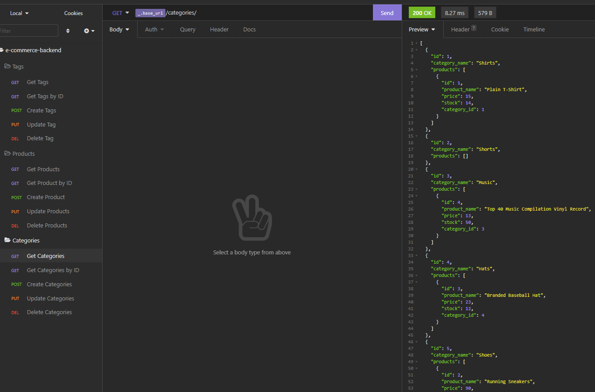
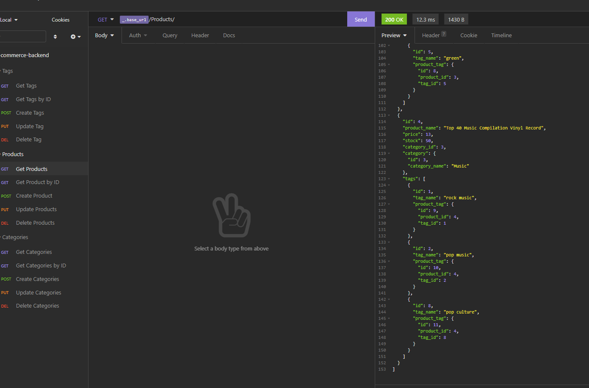
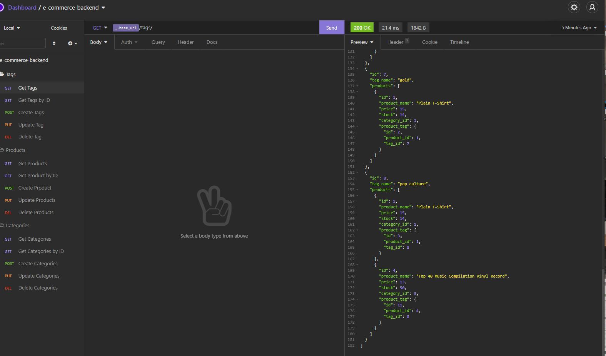

# Object-Relational-Mapping-ORM-E-Commerce-Back-End

## Description

Internet retail, also known as **e-commerce**, is the largest sector of the electronics industry, generating an estimated $29 trillion in 2019. E-commerce platforms like Shopify and WooCommerce provide a suite of services to businesses of all sizes. Due to their prevalence, understanding the fundamental architecture of these platforms will benefit any full-stack web developer. This repo contains the back end code for an e-commerce site. This configures a working Express.js API to use Sequelize to interact with a MySQL database.

## User Story

* AS A manager at an internet retail company
* I WANT a back end for my e-commerce website that uses the latest technologies
* SO THAT my company can compete with other e-commerce companies

## Acceptance Criteria

* GIVEN a functional Express.js API
* WHEN I add my database name, MySQL username, and MySQL password to an environment variable file
* THEN I am able to connect to a database using Sequelize
* WHEN I enter schema and seed commands
* THEN a development database is created and is seeded with test data
* WHEN I enter the command to invoke the application
* THEN my server is started and the Sequelize models are synced to the MySQL database
* WHEN I open API GET routes in Insomnia Core for categories, products, or tags
* THEN the data for each of these routes is displayed in a formatted JSON
* WHEN I test API POST, PUT, and DELETE routes in Insomnia Core
* THEN I am able to successfully create, update, and delete data in my database

## Installation

To install any necessary dependencies run the following command:

npm i

## Usage

Clone the repo to your local machine and open in VS code. Make sure you have node.js and npm installed (hint: node -v & npm -v). In the packages root directory, install the following packages: express.js, sequelize, mysql2, and dotenv (npm i express sequelize mysql2 dotenv). Also create a .env file in the root directory to save sensitive information such as your MYSQL username and password, and database name (ex: DB_NAME='', DB_USER='', DB_PW=''). These variables are referenced in the /config/connection.js file. From the mysql shell, run source db/schema.sql; to create the schema, quit the mysql shell and run npm run seed to seed the tables. Finally run npm start to initiate the program, open Insomnia and the app is ready to test/demonstrate API routes: GET, POST, PUT, and DELETE for categories, products, and tags.

## Video Walkthrough and link to repository and Heroku

https://drive.google.com/file/d/12vuV_wJwoKGWjvYHtkD-eJvEUOjTMbo1/view

https://github.com/odders17/Object-Relational-Mapping-ORM-E-Commerce-Back-End

https://orm-odders17.herokuapp.com/

# API ROUTES

